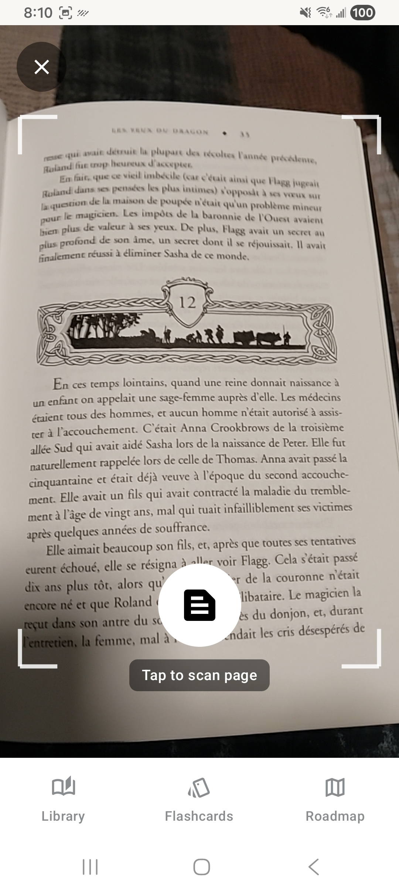
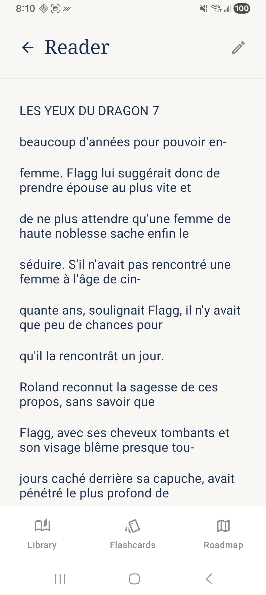
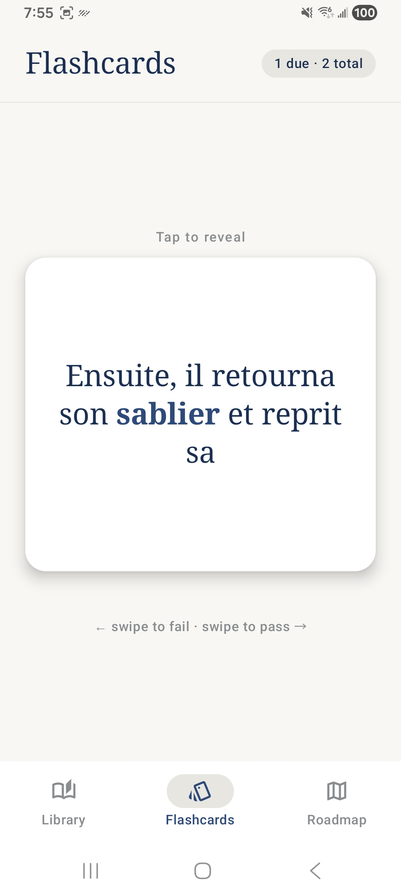

# Lumi

A French language learning app for Android that lets you scan physical books, read them on your phone, and build vocabulary through flashcards and spaced repetition.

## What it does

**Scan → Read → Learn**

1. **Scan** — Point your camera at a book page. Lumi uses Gemini Vision to extract the text, handling curved pages, varied lighting, and complex layouts.
2. **Read** — Pages are stored in your library organized by book. Tap any word for an instant French→English translation with grammar context. Long press a sentence to translate the whole thing.
3. **Learn** — Save words to flashcards with one tap. Review them with a spaced repetition system (SM-2) that schedules cards based on how well you know them.

## Screenshots

<div align="center">
  
  &nbsp;&nbsp;
  
  &nbsp;&nbsp;
  
</div>

## Features

- **Book library** — Organize scanned pages into books. Scan one page at a time and build up a book over multiple sessions.
- **Gemini Vision OCR** — AI-powered text extraction that understands document structure and reading order, far more accurate than traditional OCR on curved book pages.
- **Tap-to-translate** — Tap any word for a contextual translation and part-of-speech breakdown. Long press for full sentence translation.
- **Flashcard SRS** — Words are saved with the sentence they came from, so flashcards show context not just isolated vocabulary. Swipe right to pass, left to fail.
- **Roadmap** — Built-in French grammar learning path (in progress).

## Tech stack

- **Kotlin** + Jetpack Compose
- **CameraX** for camera capture
- **Gemini API** (`gemini-2.5-flash-lite`) for OCR and translation
- **Room** for local persistence
- **SM-2** spaced repetition algorithm

## Setup

1. Clone the repo
2. Add your Gemini API key to `local.properties`:
   ```
   GEMINI_API_KEY=your_key_here
   ```
3. Build and run on a physical Android device (API 26+)

## Status

Active development. Grammar lessons coming soon.
